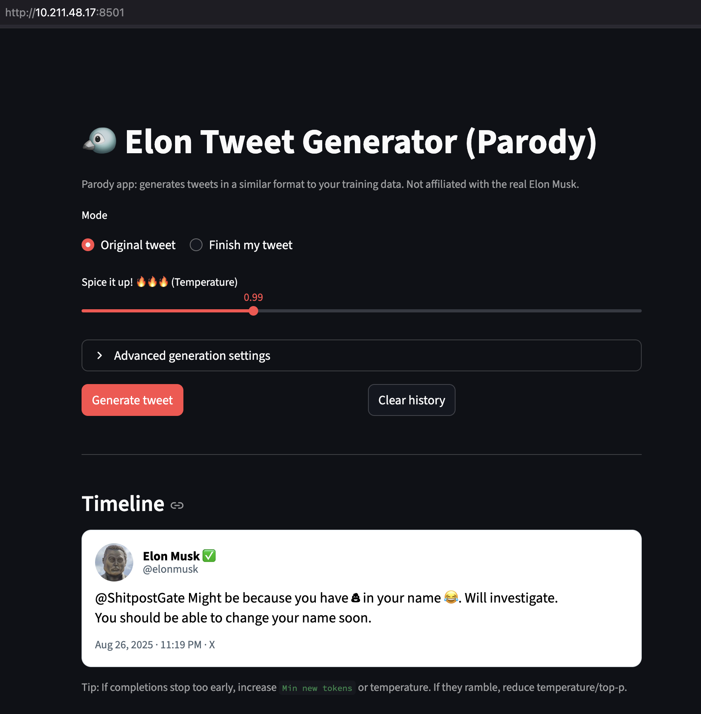

# Finetune LLMs on Custom Datasets with PEFT and Transformers

This repository provides a comprehensive guide on how to finetune large language models (LLMs) using Parameter-Efficient Fine-Tuning (PEFT) techniques with the Hugging Face Transformers library. It includes step-by-step instructions, code examples, and best practices for adapting pre-trained models to your specific datasets.

** Credits: This repository is mostly programmed by [Gabriel Mongaras](https://github.com/gmongaras). Adapted for SMU SuperPOD by [Jerry Ma](https://github.com/jerma88).**

## Tutorial

### HPC Login
1. login to SuperPOD with ssh and your SMU credentials
   ```bash
   ssh -C -D <port> <your_smu_id>@superpod.smu.edu
   ```
2. set up proxy on your browser 
    - (For Firefox) Preferences > Network Settings > Settings > Manual proxy configuration > SOCKS Host: localhost, Port: <port> (same as above) > SOCKS v5 > Proxy DNS when using SOCKS v5

### Training Setup
3. git clone this repo
   ```bash
    git clone <this_repo_url.git>
    cd <this_repo_name>
    ```

4. create virtual environment and install dependencies
   ```bash
   python3 -m venv .venv/
   source .venv/bin/activate
   pip install -r requirements.txt
   ```

5. spin up jupyter lab
   ```bash
   jupyter lab --no-browser --ip=0.0.0.0
    ```

6. click the link provided in the terminal (with your token) to open jupyter lab in your browser
You should see something like this in your terminal:
```bash
    [I 2025-08-26 23:08:36.155 ServerApp] jupyterlab | extension was successfully loaded.
    [I 2025-08-26 23:08:36.163 ServerApp] notebook | extension was successfully loaded.
    [I 2025-08-26 23:08:36.164 ServerApp] Serving notebooks from local directory: <your_path>/
    [I 2025-08-26 23:08:36.164 ServerApp] Jupyter Server 2.17.0 is running at:
    [I 2025-08-26 23:08:36.164 ServerApp] http://bcm-dgxa100-00<node_id>:8888/lab
    [I 2025-08-26 23:08:36.164 ServerApp]     http://127.0.0.1:8888/lab
    [I 2025-08-26 23:08:36.164 ServerApp] Use Control-C to stop this server and shut down all kernels (twice to skip confirmation).
```

Copy *http://bcm-dgxa100-00<node_id>:8888/lab* and paste it in your browser that you configured proxy for. You should now be able to access jupyter lab running on SuperPOD.

7. open `finetune_peft_transformers.ipynb` and follow the steps in the notebook to finetune a LLM on your custom dataset!

### Inference Setup
8. After training, open a new terminal on jupyter lab in your browser and activate your virtual environment
   ```bash
   source .venv/bin/activate
   ```
   You MUST do this on the jupyter lab terminal, since your proxy is only configured for this jupyter lab session.

9. run the app
    ```bash
    streamlit run app.py
    ```

    you should see something like this in your terminal:
    ```bash
      You can now view your Streamlit app in your browser.

  Local URL: http://localhost:8501
  Network URL: http://10.211.48.17:8501
  External URL: http://129.119.55.211:8501
    ```

10. copy *Network URL* and paste it in a new tab in the browser that you configured proxy for. You should now be able to access the inference app running on SuperPOD.

11. generate tweets like Elon Musk with your finetuned model!

